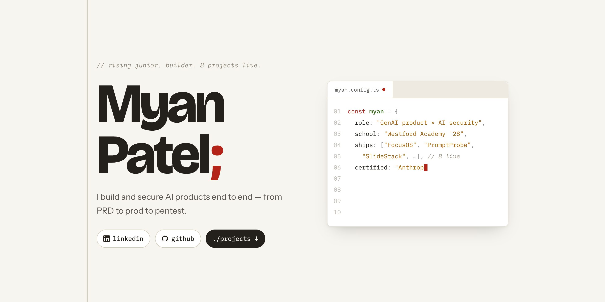

# myan-portfolio

[](https://myan-portfolio.vercel.app)

Personal portfolio built as *syntax on paper*: a light editor theme used as a
design system rather than a decoration. Section headers are real declarations,
the hero types itself out, and the GitHub stats are live.

**Live:** https://myan-portfolio.vercel.app

## The idea

Most developer portfolios either look like a terminal or like a template. This
one treats the syntax palette as the design system, on warm stone paper instead
of a dark editor:

| Token | Colour | Means |
|---|---|---|
| `--keyword` | brick red | actions and links |
| `--entity` | forest green | names |
| `--string` | dark amber | data and tags |
| `--comment` | warm gray | meta |

Every section header renders as the export it actually is, down to the real line
number in `src/data/profile.js`. A test enforces that those line numbers stay
truthful, because they silently drifted once already.

## Stack

React 19 and Vite, no framework beyond that. Deliberately minimal: the only
runtime dependencies are `react` and `react-dom`.

## Running it

```bash
npm install
npm run dev      # vite dev server
npm run build    # production build
npm test         # vitest
```

## Layout

```
src/
├── components/   # hero, experience, projects, skills, credentials, layout
├── hooks/        # useGithubStats, useCodeTyper, useScrollReveal
├── data/         # profile.js — the single source of content
└── styles/       # tokens.css, typography, global
tests/            # section-decl.test.js
```

## Notes

- Animation stays on `transform` and `opacity`, and respects `prefers-reduced-motion`.
- GitHub stats are fetched unauthenticated, so rate limiting and errors are
  handled visibly rather than silently. No fabricated numbers.
- No secrets ship in the client bundle.

## Licence

MIT, see [LICENSE](LICENSE).
